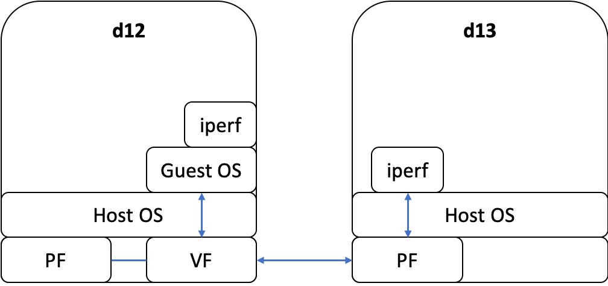

# SR-IOV NIC Passthrough
Direct NIC assignment allows a virtual mahcine to have an exclusive access to the device and achieve the near-native network performance.

# Network Card
Mellanox ConnectX-3 Pro (MLX)

# Network Layout


# Set Up a Virtual Function
```
modprobe -r mlx4_ib
modprobe -r mlx4_en
modprobe -r mlx4_core
vfs=1
modprobe mlx4_core num_vfs=$vfs log_num_mgm_entry_size=-1 port_type_array=2,2
ip link show | grep vf
```

# Set Up a Private Network on MLX
- d12
```
$ ip link set ens4 up
$ ip addr add 192.168.0.12/24 dev ens4
```
- d13
```
$ ip link set ens4 up
$ ip addr add 192.168.0.13/24 dev ens4
```
- test on d12
```
$ ping -c 1 -w 1 192.168.0.13
```

# Set Up VFIO
```
$ modprobe vfio-pci
$ lspci -nn | grep -i ethernet
$ echo "15b3 1004" > /sys/bus/pci/drivers/vfio-pci/new_id
$ ls -l /sys/bus/pci/drivers/vfio-pci/
```

# Boot a VM
```
$ vcpu=1
$ memory="2G"
$ vm_image="test.qcow2"
$ index=0
$ bdf="04:00.1"

$ BASE=1000
$ tport=$(( BASE + index ))
$ echo "vm: telnet:127.0.0.1:${tport}"

$ qemu-system-x86_64 \
        -enable-kvm \
        -cpu host,host-cache-info=on \
        -smp cpus=${vcpu},sockets=1,threads=1,maxcpus=${vcpu} \
        -m   ${memory} \
        -drive file=${vm_image},if=virtio \
        -device vfio-pci,host=${bdf},id=pnic \
        -serial telnet:127.0.0.1:${tport},server,nowait \
        -parallel none \
        -serial none \
        -net none \
        -vga none \
        -nographic \
        -nodefaults
```

# Configure the VM's Network
```
# Log into the VM by telnet
$ telnet 127.0.0.1 1000

# When we are in the VM
$ mlx="ens2"
$ ip link set $mlx up
$ ip addr flush dev $mlx
$ ip addr add 192.168.0.101/24 dev $mlx
$ ping -c 1 -w 1 192.168.0.13
```
